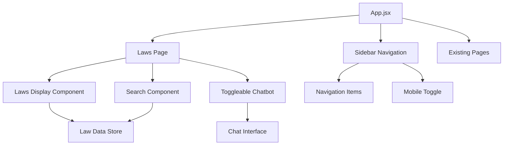

# Design Document

## Overview

The Cybersecurity Laws Documentation feature will create a comprehensive legal reference system with integrated AI assistance. The system consists of three main components: a laws documentation page with search functionality, a sidebar navigation system replacing the current navbar, and a toggleable chatbot interface similar to Brave's Leo assistant.

The application will leverage the existing React + Vite + TailwindCSS stack and integrate seamlessly with the current architecture while introducing new pages and components for legal documentation.

## Architecture

### High-Level Architecture



### Component Hierarchy

- **App.jsx** (Root)
  - **Sidebar** (Global Navigation)
    - Navigation Links
    - Mobile Toggle
  - **LawsPage** (New Page)
    - **LawsHeader** (Page Title)
    - **SearchBar** (Real-time filtering)
    - **LawsList** (Scrollable law entries)
      - **LawCard** (Individual law display)
    - **ChatbotToggle** (Floating button)
    - **Chatbot** (Slide-in interface)
      - **ChatInterface** (Messages + Input)

## Components and Interfaces

### 1. Sidebar Navigation System

**Purpose:** Replace the current navbar with a collapsible sidebar for better space utilization.

**Key Features:**
- Vertical navigation layout
- Collapsible on mobile with hamburger menu
- Persistent across all pages
- Integration with existing routing

**Props Interface:**
```javascript
interface SidebarProps {
  isOpen: boolean;
  onToggle: () => void;
  currentPage: string;
  navigationItems: NavigationItem[];
}
```

### 2. Laws Documentation Page

**Purpose:** Main page for displaying and searching cybersecurity laws.

**Key Features:**
- Professional heading and layout
- Real-time search functionality
- Structured law display (Act, Section, Theory)
- Responsive design

**Component Structure:**
```javascript
// LawsPage.jsx
const LawsPage = () => {
  const [searchQuery, setSearchQuery] = useState('');
  const [filteredLaws, setFilteredLaws] = useState(lawsData);
  const [chatbotOpen, setChatbotOpen] = useState(false);
  
  // Search and filter logic
  // Chatbot toggle logic
  // Render components
};
```

### 3. Search Component

**Purpose:** Provide real-time filtering of laws based on user input.

**Key Features:**
- Instant search results
- Search across act names, sections, and content
- Highlight matching text
- Clear search functionality

**Search Algorithm:**
```javascript
const searchLaws = (query, laws) => {
  if (!query.trim()) return laws;
  
  return laws.filter(law => 
    law.act.toLowerCase().includes(query.toLowerCase()) ||
    law.section.toLowerCase().includes(query.toLowerCase()) ||
    law.theory.toLowerCase().includes(query.toLowerCase())
  );
};
```

### 4. Toggleable Chatbot

**Purpose:** Provide AI assistance for legal interpretation, similar to Brave's Leo.

**Key Features:**
- Slide-in/out animation from the right side
- Floating toggle button when closed
- Chat interface with message history
- Responsive overlay on mobile

**Animation Behavior:**
```css
.chatbot-container {
  transform: translateX(100%);
  transition: transform 0.3s ease-in-out;
}

.chatbot-container.open {
  transform: translateX(0);
}
```

### 5. Law Data Structure

**Purpose:** Frontend storage for all cybersecurity laws.

**Data Schema:**
```javascript
interface Law {
  id: string;
  act: string;           // e.g., "Information Technology Act"
  section: string;       // e.g., "Section 43A"
  theory: string;        // Detailed explanation
  keywords: string[];    // For enhanced search
  lastUpdated: Date;
}

const lawsData: Law[] = [
  {
    id: "ita-43a",
    act: "Information Technology Act, 2000",
    section: "Section 43A",
    theory: "Compensation for failure to protect data...",
    keywords: ["data protection", "compensation", "negligence"],
    lastUpdated: new Date("2023-01-01")
  }
  // Additional laws...
];
```

## Data Models

### Law Entity
```typescript
interface Law {
  id: string;
  act: string;
  section: string;
  theory: string;
  keywords: string[];
  lastUpdated: Date;
  category?: string;
  relatedSections?: string[];
}
```

### Search State
```typescript
interface SearchState {
  query: string;
  results: Law[];
  isSearching: boolean;
  highlightedTerms: string[];
}
```

### Chatbot State
```typescript
interface ChatbotState {
  isOpen: boolean;
  messages: ChatMessage[];
  isTyping: boolean;
  currentInput: string;
}

interface ChatMessage {
  id: string;
  text: string;
  sender: 'user' | 'bot';
  timestamp: Date;
}
```

## Error Handling

### Search Errors
- **Empty Results:** Display "No laws found matching your search" message
- **Invalid Input:** Sanitize search input to prevent XSS
- **Performance:** Debounce search input to prevent excessive filtering

### Chatbot Errors
- **Connection Issues:** Show offline indicator and queue messages
- **Invalid Responses:** Display fallback error message
- **Rate Limiting:** Implement user-friendly rate limit notifications

### Data Loading Errors
- **Missing Data:** Show placeholder content with error message
- **Malformed Data:** Validate law data structure on load
- **Browser Compatibility:** Provide fallbacks for older browsers

## Testing Strategy

### Unit Tests
- **Search Functionality:** Test filtering logic with various inputs
- **Data Validation:** Verify law data structure integrity
- **Component Rendering:** Test individual component rendering
- **State Management:** Verify state updates and side effects

### Integration Tests
- **Search Integration:** Test search component with laws data
- **Navigation Flow:** Test sidebar navigation between pages
- **Chatbot Integration:** Test chatbot toggle and interaction
- **Responsive Behavior:** Test layout adaptation across screen sizes

### End-to-End Tests
- **User Journey:** Complete flow from navigation to law search
- **Cross-Browser:** Test functionality across major browsers
- **Mobile Experience:** Test mobile-specific interactions
- **Performance:** Measure search response times and rendering

### Test Data
```javascript
const mockLawsData = [
  {
    id: "test-1",
    act: "Test Cybersecurity Act",
    section: "Section 1",
    theory: "This is a test law for validation purposes",
    keywords: ["test", "validation"],
    lastUpdated: new Date()
  }
  // Additional test data...
];
```

## Implementation Considerations

### Performance Optimization
- **Search Debouncing:** Implement 300ms debounce for search input
- **Virtual Scrolling:** Consider for large law datasets (>1000 entries)
- **Lazy Loading:** Load law content on demand if dataset grows
- **Memoization:** Use React.memo for law card components

### Accessibility
- **Keyboard Navigation:** Full keyboard support for search and navigation
- **Screen Readers:** Proper ARIA labels and semantic HTML
- **Focus Management:** Logical focus flow through components
- **Color Contrast:** Ensure WCAG AA compliance for text readability

### Mobile Considerations
- **Touch Targets:** Minimum 44px touch targets for mobile
- **Swipe Gestures:** Consider swipe to close chatbot on mobile
- **Viewport Handling:** Proper viewport meta tag configuration
- **Performance:** Optimize for mobile network conditions

### Browser Compatibility
- **Modern Browsers:** Chrome 90+, Firefox 88+, Safari 14+, Edge 90+
- **Polyfills:** Include necessary polyfills for older browser support
- **Progressive Enhancement:** Core functionality works without JavaScript
- **Fallbacks:** CSS fallbacks for unsupported features